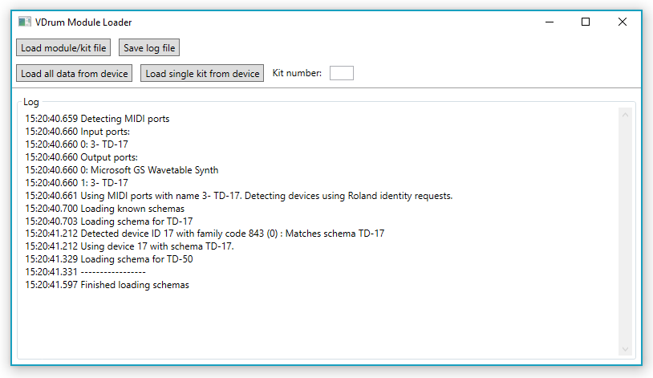
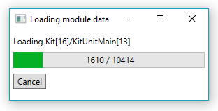
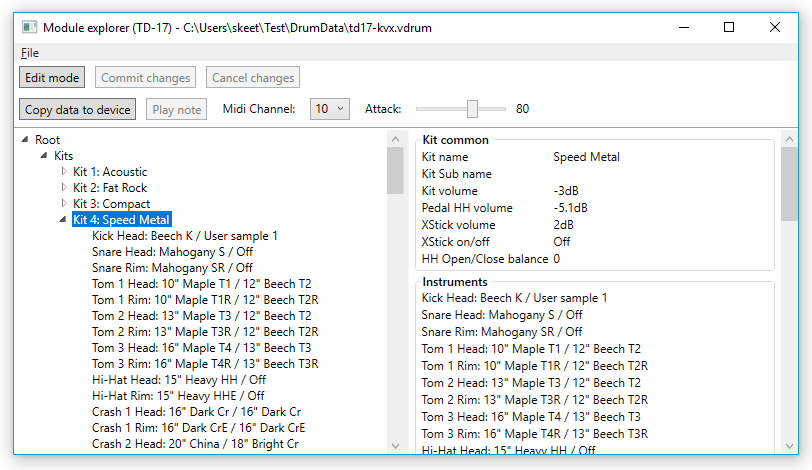
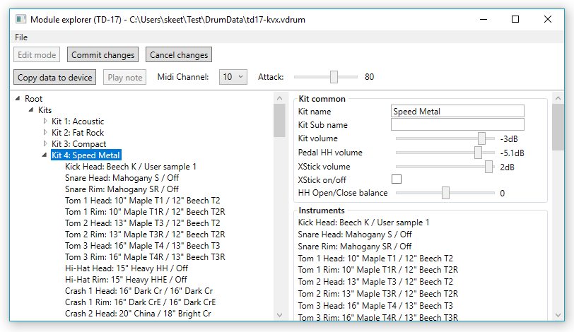
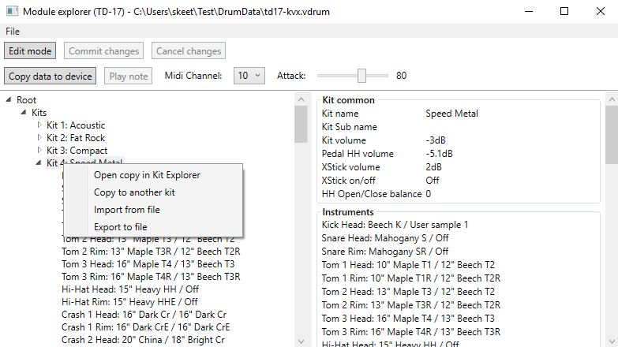
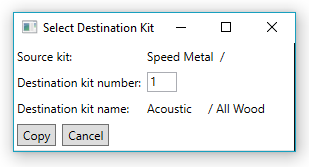
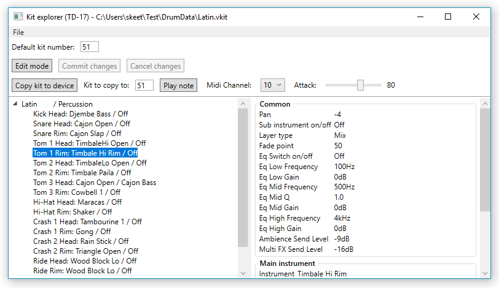
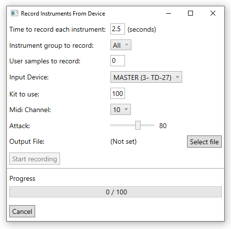
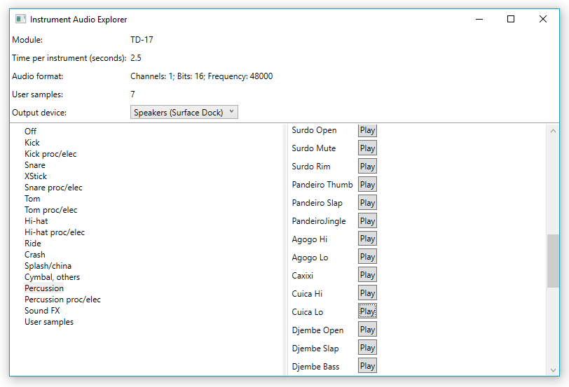

# Documentation for V-Drum Explorer

All source code is in the [Drums directory of the GitHub repo](https://github.com/jskeet/DemoCode/tree/master/Drums).

This is not a MIDI sequencer or anything similar; it's purely for
fetching and manipulating information from Roland V-Drum kits.

I'm very grateful to Roland for providing the [TD-17 MIDI
implementation](https://static.roland.com/assets/media/pdf/TD-17_MIDI_Imple_eng01_W.pdf) document which has been absolutely vital in
writing this code. (There's now a [new document](https://static.roland.com/assets/media/pdf/TD-17_MIDI_Imple_eng04_W.pdf) as well, with
changes for the v2 firmware.)

Feedback is very welcome - it's still early days, but please email
skeet@pobox.com or [file an
issue](https://github.com/jskeet/DemoCode/issues/new) to let me know
how you get on with this.

**Note: this user guide is accurate to 1.0.0-alpha05; it needs
updating for 1.0.0-alpha06+, with new screenshots etc.**

# Requirements

- Windows 8.1, Windows 10 or Windows 11
- .NET 4.8 or later
- To be genuinely useful, a Roland TD-07, TD-17, TD-27, TD-50, or TD-50X V-Drums drum kit, turned on and connected via USB (see later for details)

# Installation

Download: [Windows Installer](https://github.com/jskeet/DemoCode/releases/download/VDrumExplorer-1.0.0-alpha14/VDrumExplorer-Setup-1.0.0-alpha14.msi)

As of 1.0.0-alpha02, there's a Windows installer. Download the
latest installer above, or from the [releases](https://github.com/jskeet/DemoCode/releases)
on GitHub. If you use GitHub, you'll need to expand the "Assets" part of the given release. If
you'd prefer not to run the installer, there's a zip file as well.

The application that's installed is called "V-Drum Explorer"; if
you're using the zip file, you want to run VDrumExplorer.Wpf.exe.

If Windows SmartScreen gives a warning, click on "More Info", check that it is signed
by me ("Jonathan Skeet") and then choose the option to run it.

**Important notes for drum kit connection**

The USB Driver Mode must be "vendor" for the V-Drum Explorer to
detect it. The "generic" USB mode is the factory default, so you'll
need to change this (which includes a drum kit reboot) before
starting the Explorer.

Additionally, in MIDI settings, the "Receive Exclusive" option must
be set to "On".

# Usage

There are four windows in the application:

- [Module Loader](#module-loader)
- [Module Explorer](#module-explorer)
- [Kit Explorer](#kit-explorer)
- [Instrument Audio Explorer](#instrument-audio-explorer)

When the application is launched, the Module Loader will be shown.

## Module Loader

This window should be left open; closing it will close all other
windows. It also contains the log which can be saved to disk and
then included when [filing an
issue](https://github.com/jskeet/DemoCode/issues/new)

The log will include diagnostics as the application attempts to
detect a drum module. In the screenshot above, it's detected my TD-17.
If no known module is detected, the second row of buttons will be
disabled.

### "Offline" functionality (no drum module required)

Even without a drum module, you can still load and save
files, and edit the data.

Click on "Load file" to load a file. The application will
detect whether it contains data for a whole module or a single kit,
or instrument audio, and display the appropriate window, as described later. A sample
file (td17.vdrum) is provided with the application. (If you run the
Windows installer, the file is installed in
'Program Files (x86)\VDrumExplorer' - I know that's a little odd as
it isn't a binary, but it simplifies things while I'm learning about
Windows installers and WiX.)

Click on "Save log file" to simply save the contents of the log (as
displayed in the Module Loader) to a text file. This is primarily to
make it easy to report issues. Note that this single log is used for
all logging, including for log entries created by other windows.

### "Live" functionality (drum module on and connected via USB)

If a module is detected, you can load data from it with the two
buttons in the second row:

- Load the complete data for a module with the "Load all data" button
- Load a single kit by entering the kit number and clicking "Load single"

When loading a single kit, the value in the "Kit number" textbox
should be an integer between 1 and 100. (If other modules are ever
supported, this range may vary.)

Loading a single kit is reasonably quick - a few seconds - but
loading the complete module data takes about three minutes for the
TD-17, and longer for the TD-27, TD-50 or TD-50X. You'll see a progress dialog like
this:

You can cancel at any time, but I strongly recommend that if you
wait until the complete module data has loaded, you then save it to
a file so you can load that next time.

## Module Explorer

The Module Explorer allows you to view and edit almost all the data
in a module. (There are some aspects that aren't available, such as
sample data.)

Information is presented in a tree view, with details of the
currently selected tree node in a panel on the right hand side.
Initially, the explorer is in read-only mode.

If no drum module was detected when the application was loaded, or
if the module isn't the same as the source of the data being shown
in the explorer (e.g. you have a TD-17 but you're exploring TD-50
data), the second row of buttons will not be present.

### Edit mode

Click "edit mode" to enable editing. You stay in edit mode even if
you change tree nodes, so you can edit multiple aspects at a time.

It's important to understand that when you're in edit mode, you're
only editing the data in memory. Nothing is automatically saved to a
file, or copied to the physical drum module. Those actions have to
be taken explicitly.

To leave edit mode, you can click on either "Commit changes" or
"Cancel changes". (This *still* only makes a difference to the data
in memory.) If you click on "Cancel changes," all the changes you
made in edit mode are reverted. If you click on "Commit changes"
you'll see the changes you made in read-only mode.

### Playing a note

When a drum module is connected and an instrument is selected, the
"Play note" button is enabled. This is intended to provide a
convenient way of experimenting with the settings you're editing,
but its functionality is fairly crude: it *just* tells the module to
play the selected instrument, as specified in the MIDI settings for
the kit.

Use the "attack" slider to simulate hitting the drum hard or softly.

In particular:

- If you have made any changes to the kit but not copied them to the
device, you won't hear the results of the changes.
- If the currently selected kit on the physical device isn't the
same as the one you've made changes to, you'll hear the "wrong"
instrument.

If you don't hear *anything*, check the MIDI channel used by your
module. The application defaults to 10, which is the default channel
for the TD-17.

### Copying data to the device

The "Copy data to device" button will copy all the information from
the currently selected tree node and all child nodes, onto the device.
This can be very quick if you're copying a single instrument;
copying a whole kit takes a bit longer. Copying the entire module
data (from "Root" downwards) will take a very long time.

Note that in edit mode, the data copied is what you currently see,
including any changes you've made.

### Kit context options

Right-clicking on a the root node of a kit within the tree will open
a context menu like this:

This currently provides four options:

- Create an independent copy of the kit in memory, and open it in
  Kit Explorer
- Copy the kit to another slot in the module (overwriting the
  current kit there)
- Import data from a .vkit file (overwriting the data in the current
  kit)
- Export the current kit data to a .vkit file

For the second of these options, a dialog box opens asking you which
kit you would like to copy the selected one to:

### Saving to disk

The File/Save menu item allows you to save the whole module data to
a .vdrum file, which can be opened later in Module Loader.

## Kit Explorer

Kit Explorer works very similarly to Module Explorer, except it
operates on a single kit instead of the data for a whole module.

### Copying the kit to the device

The "Copy kit to device" button will copy the kit data
to the kit specified in the textbox. (This must be a valid kit
number for your module.) In Kit Explorer, the whole kit data is
always copied, rather than just information from the selected tree
node.

A kit file has a "default kit number" which is used to populate this
textbox on loading. This number starts off as the original kit that
was taken from the module, but can be modified with the "Default kit
number" textbox. Typically you'd want to set it to the number that
you most often use on the device for that kit.

### Saving to disk

The File/Save menu item allows you to save the kit to a .vkit file,
which can be opened later in Module Loader.

## Instrument Audio Explorer

Playing an instrument within the Kit Explorer or Module Explorer
requires you to have the module connected, with the right instrument
on the currently selected kit. That makes it hard to edit a kit on
the move, unless you know exactly what each instrument sounds like.

V-Drum Explorer allows you to record all the instruments from your
module via the audio connection to your computer, save the data to a
file, then load the file again later to allow you to play each
instrument without the module being present.

### Recording instruments

To take advantage of this functionality, first you need to record
the audio data. Start V-Drum Explorer with the module connected and
turned on, then click on "Record instruments" in the Module Loader.

The instrument recording dialog will be displayed:

Before recording, there are some things to check:

- Make sure your USB audio output is set appropriately. The default
  setting on the TD-17 is very quiet, for example. In the TD-17, on
  the module, press the Setup button, select the USB option, and set
  the "USB Output Gain" option. I had success with a setting of +20dB.
- Optionally select an instrument group to record, or leave it at the
  default "All" to record all instruments. If you only want to record
  user samples, select the "Off" instrument group. (That contains a
  single instrument called "Off", but at that point you're not wasting
  much time recording silence.)
  - Currently there's no way of recording "just some" instrument
    groups; it's either all or a single group. Please give me feedback
    if this limitation causes you any practical difficulties.
- Select how many user samples you wish to record. There's no point in
  recording more samples than are populated on your module, but the
  explorer can't determine how many there are. Also, you may not wish
  to record the samples anyway.
- Select the relevant audio device in the dialog, if a suitable one
  isn't picked by default.
  - For the TD-17, the audio device is likely to be of the form "IN (3- TD-17)".
  - For the TD-27 (and I suspect the TD-50), each trigger can be recorded separately.
    Either record the KICK input, or MASTER. Note that the pad to record
    is KICK regardless of which instrument group is being recorded, as
    all samples are played through the kick trigger.
- Make sure your module has the same kit selected as is shown in the
  dialog box. You can edit this; I'd recommend using a "user" kit that
  is still untouched, for two reasons:
  - It won't have any MultiFX etc applied to it, so you'll get a
    fairly vanilla recording.
  - If the explorer crashes while recording, you won't have lost any
    useful data. (See notes below for what the process involves.)
- Choose a file to save the data to. Note that the files can be
  quite large (e.g. around 75MB for a TD-17 with 7 user samples and
  the default 2.5s recording duration) so make sure there is enough
  disk space wherever you're saving to.
- Make sure the MIDI channel is correct for your kit. (This is the
  same channel used to play instruments in the Module Explorer and Kit
  Explorer, so that's an easy way to test it.)
- Optionally change the recording duration per instrument and the
  attack with which each instrument is struck. The defaults should be
  fine in most cases.

Once you're ready, click "Start recording". Importantly, you need to
leave the drum set alone at this point: if you change settings on
the module, or strike the pads, you could end up with undesirable
results.

**Note:** Recording all the samples takes a long time, particularly
on the TD-50/TD-50X with over 400 instruments or the TD-27 with over 750!
As well as the recording time itself, there's a little overhead
while the instrument is changed etc. So on a TD-50, recording 2.5s
of audio per instrument could take over 20 minutes. Please be
patient! (The progress bar will show you how it's doing, of course.)

The process works as follows:

- Load the data for instrument 1 (the kick drum) from the
  kit, so it can be restored later.
- For each available instrument:
  - Silence the module (to stop the previous instrument sound)
  - Change the assigned instrument for instrument 1 on the module
  - Start recording in memory
  - Play the note
  - Stop recording after the configured duration
- Save the file containing all the audio captures
- Restore the original data, including if an error occurs

The last part about data restoration can fail in some situations - for
example if you disconnect the USB cable while recording. For this
reason, I recommend backing up the kit first if you've made any
modifications to it, or (preferably) using a kit you haven't modified.

When recording is complete, the dialog will close automatically.

### Opening the Instrument Audio Explorer

In order to open the Instrument Audio Explorer, click on "Load File"
in the Module Loader and open a previously-saved audio recording
.vaudio file. This will open up the Instrument Audio Explorer:

Select an output device from the drop-down ("Speakers (Surface
Dock)" in the screenshot above) and then click on one of the
instrument groups on the left hand side. The recorded instruments
will be shown on the right hand side, with Play buttons. Clicking on
a Play button will play the recorded sample from the file.

Note that you can have an Instrument Audio Explorer window open at
the same time as a Kit Explorer or Module Explorer window, and this
is the recommended approach if you're trying to work out which
instruments to include in a new kit.

**Quality note:** When developing the feature, some recordings ended
up being cut off when playing back. This is definitely a problem
with the recording side rather than the playback side. I *believe*
I've fixed it, but I can't be sure. It's most noticeable on
percussion and sound FX instruments. If you run into this problem,
please let me know (skeet@pobox.com) - you may well find that just
re-recording the file fixes it, but I'd like to know anyway. (And
apologies in advance.)

# Further work

- Selective instrument recording, and possibly audio format selection
- Change kit (and back) when recording instruments
- Make the Instrument Audio Explorer prettier (do we really need so
  many Play buttons?)
- An icon!
- Cleaner user interface for loading or copying a single kit (the textbox is ugly)
- Defaults for TD-50 instruments (e.g. size for cymbals)
- UI options, e.g. whether to use sliders
- Load/save/overlay masked instrument settings
- (Internal) Consider generating/writing C# code from schema to have a cleaner model

# Version history

## Version 1.0.0-alpha14 (2023-03-12)

- Support for new MFX in TD-17 v2 firmware
- Ability to convert kits/modules between firmware versions

## Version 1.0.0-alpha13 (2023-02-17)

- Fixed bug when overwriting existing file (if the new file is shorter, old data would still be present)

## Version 1.0.0-alpha12 (2023-01-09)

- Requires .NET 4.8 instead of 4.7.2
- Minor schema fixes (e.g. attack in KitMasterComp)
- Detection of software revisions (module firmware)
- Support for TD-17 and TD-27 version 2 firmware

## Version 1.0.0-alpha11 (2021-11-12)

- Fixes to TD-50X communications (it actually works now...)
- Fixes to TD-50X schema
- Initial support for "copy node" and "paste node", allowing
  instruments (or MFX settings, or trigger banks etc) to be
  copy/pasted within one explorer window. The UI for this may change
  over time, but it does appear to work.

## Version 1.0.0-alpha10 (2021-11-03)

- Attempted fix for TD-50X communication
- Disable Copy Data / Play Note buttons when not connected to the right module

## Version 1.0.0-alpha09 (2021-11-02)

Changes since 1.0.0-alpha08:

- Initial support for TD-07 (definitely "mostly works"; there may be some schema issues)
- Fix for TD-50X schema that would prevent instrument recording

## Version 1.0.0-alpha08 (2021-10-30)

Changes since 1.0.0-alpha07:

- Added initial support for TD-50X (see below)
- Added new trigger list for TD-17 firmware 1.0.2
- Minor fixes to TD-27 and TD-50 schemas

The TD-50X support may well be entirely broken; I can't test it
personally. The schema launches in the schema explorer, but that's
all I can say about it right now.

## Version 1.0.0-alpha07 (2020-08-22)

- Added non-crashing validation while loading data
- Fix MFX default values
- Populate schema for AE-10 Chorus, Reverb and MFX
- Fixes to TD-50 schema (fixes #120)
- **Highly** experimental support for the Aerophone Mini (AE-01)

(The Aerophone Mini doesn't have a MIDI implementation document, so
this is all based on observed values after modifying the
configuration using the app. There's all kinds of oddness that I
haven't tried to address yet. I've no idea what happens if you try
to set things that should be read-only, like the version number.
Custom fingering is only present for "fingering 1" because the UI
for it is basically not there yet. But hey, it's a start...)

## Version 1.0.0-alpha06 (2020-08-11)

This is the first version with a complete new user interface
implementation. While much of it looks the same as previous
versions, it's all changed under the hood - which means there may
well be some bugs lurking. On the other hand, there are plenty of
new features too:

- Better instrument recording and a cleaner Instrument Explorer
  interface.
- Early support for the Aerophone AE-10. Yes, I realize
  the Aerophone isn't a drum kit, but it uses the same protocol
  for configuration (at least largely). There are various known
  issues with this at the moment, particularly around the
  Chorus/Reverb/MFX schema being very, very incomplete.
- "Schema Explorer" allowing you to inspect the containers and
  fields for any supported instrument.
- Many updates to schema aspects which were inaccurate in previous
  releases.

## Version 1.0.0-alpha05 (2020-05-24)

- Fixed [issue 97](https://github.com/jskeet/DemoCode/issues/97)
  where the presence of multiple MIDI devices unnecessarily aborted
  module detection.
  
There are some known schema issues in the TD-27 schema which are
addressed in the new codebase but not here (as keeping track of
things in both places is really tricky).

This is likely to be the last release of the "old" code, as the
"new" code is approaching feature parity.

## Version 1.0.0-alpha04 (2020-03-28)

- Fixed incorrect schema data (mostly in multifx, but also one TD-27 midi field, and TD-27 output assignments)
- Progress dialog when copying data to the module
- Top-level small containers moved to a "Setup" node under the root for simpler copying

## Version 1.0.0-alpha03 (2020-03-01)

- Initial support for TD-27
- Change MIDI library choice (hopefully invisible to most users)
- Fix stack overflow error on some changes
- Fix tempo sync switch not reflecting in UI
- Select the first output device as a reasonable default in Instrument Audio Explorer
- Attempt to find a reasonable default input device in instrument recording dialog

## Version 1.0.0-alpha02 (2019-10-03)

- Ability to record instrument sounds and then open the Instrument Audio Explorer
- Windows installer
- Moved "Open copy in Kit Explorer" to context menu
- Added "Copy kit" feature (in context menu)
- Added "Import kit from file" feature (in context menu)
- Added "Export kit to file" feature (in context menu)

## Version 1.0.0-alpha01 (2019-09-27)

- Publish .NET Core 3.0 version
- Change away from 0.x to be consistent with my general thoughts on versioning
- Log the version number on startup
- Code is now signed with a personal certificate
- Remember file that was loaded, and split save/save-as functionality
- Remember overlaid containers within an edit session (e.g.
  switching between multi-fx options, don't forget everything on each
  switch)
- Default cymbal sizes with the instrument is changed (TD-17 only for now)
- Better default values in overlays
- Add exception logging if something goes wrong when writing to the device
- Fix the Ride vedit overlay for the TD-50
- Introduce a "default kit number" in kit files, and allow it to be edited
- Improve display of the root node in Kit Explorer (no more "Kit 1")
- The use of sliders for numeric fields

## Version 0.1, 2019-09-15

Initial release after private testing
